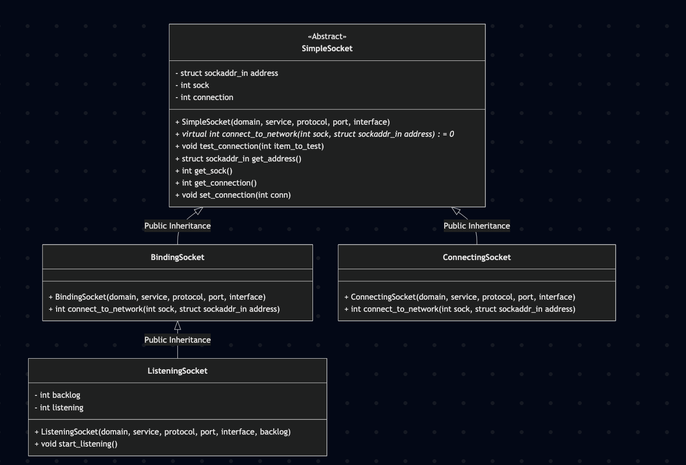

# Custom HTTP Server in C++

A custom HTTP server implemented in C++ using standard UNIX socket system calls (`socket`, `bind`, `listen`, `accept`) and object-oriented networking abstractions.

---
## Architectural diagram


From the project root directory, run:

```bash
g++ -std=c++17 -Wall -I. \
  berner.cpp \
  Networking/SimpleSocket.cpp \
  Networking/BindingSocket.cpp \
  Networking/ListeningSocket.cpp \
  -o server
```

```bash
./server
```

Navigate to [http://localhost:8080](http://localhost:8080)


